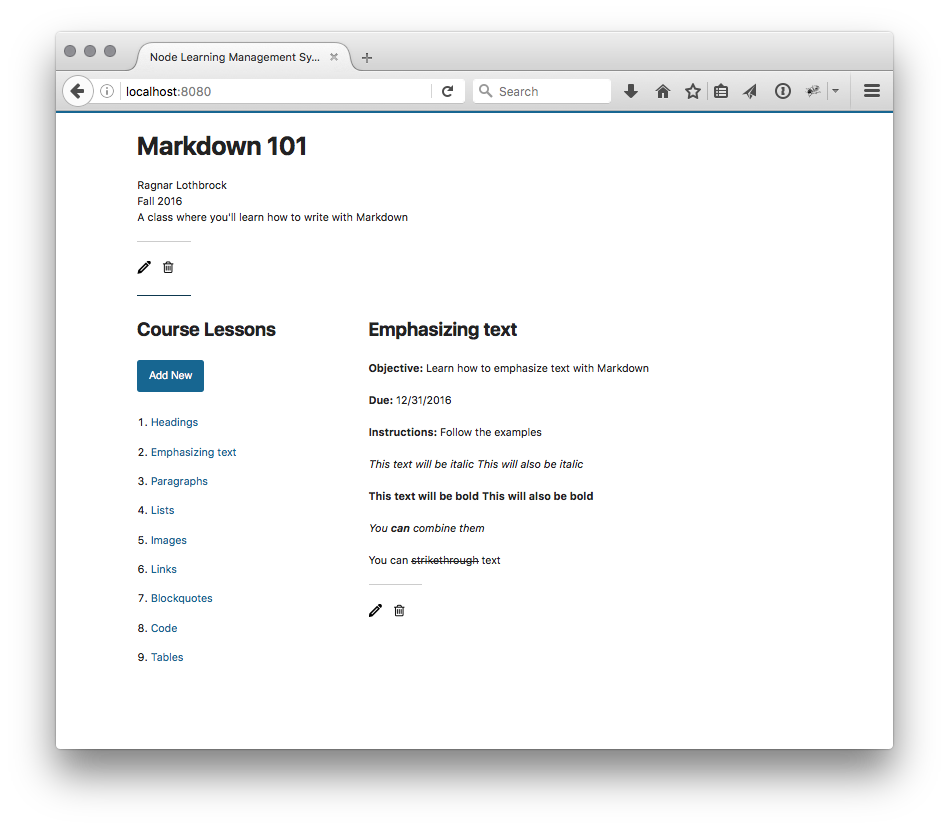
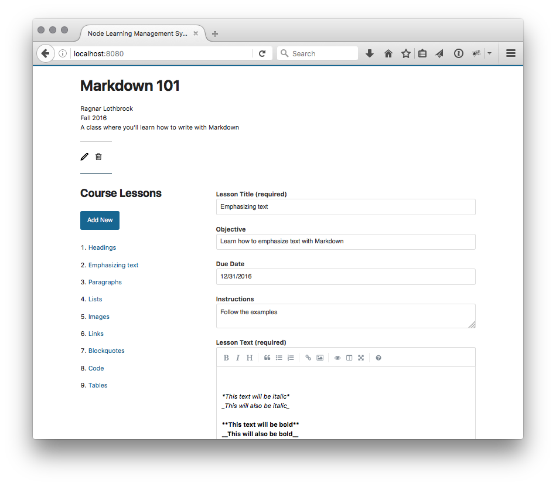
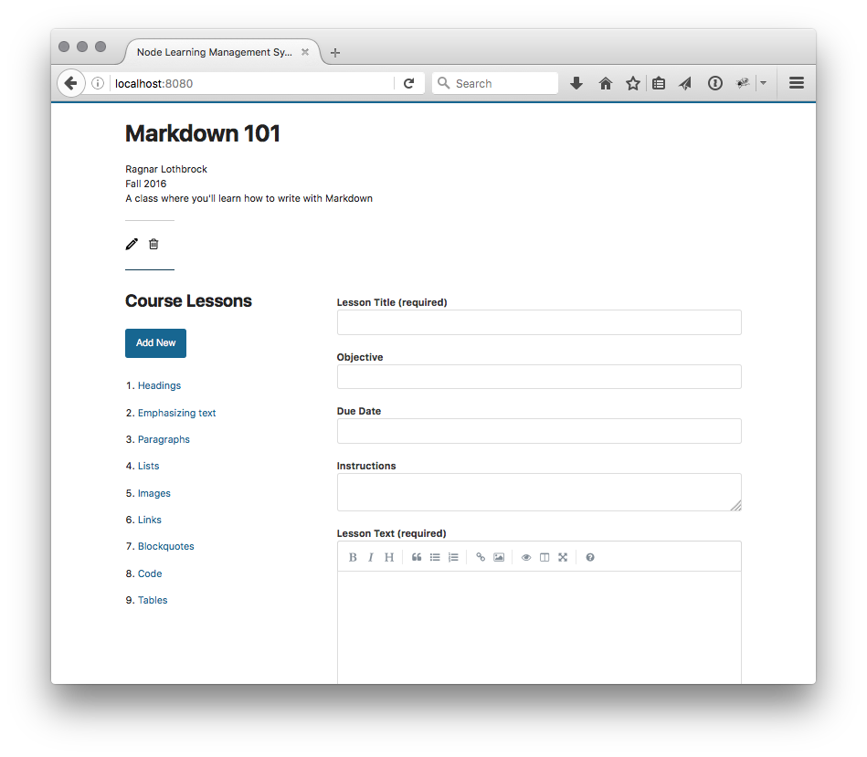

# Node Learning Management System

## Background

My motivation for this app was to build something that would make it easy for educators to create a sequence of lessons or steps for a single course or assignment.

## Use Case

Educators who find traditional learning management systems like [BlackBoard](http://www.blackboard.com/), [Desire2Learn](https://www.d2l.com/), or [Moodle](https://moodle.org/) unnecessarily complicated might find this app particularly useful.

Sometimes having so many features available such as video conferencing or [Turnitin](http://turnitin.com/) can be intimidating for some professors and instructors to use, and this app can serve as an effective supplement to an organization's exiting LMS by making lesson and assignment creation as simple as using a word processor.

## Functionality

* Create, edit, and delete a course
* Create, edit, and delete course lessons
* Write content in markdown

## Screenshots

Fig. 1 – Sample lesson

***

Fig. 2 – Edit lesson

***

Fig. 3 – Create lesson

## Technology Used

This app is built on [Node.js](https://nodejs.org/en/), [Express.js](https://expressjs.com/), and [MongoDB](https://www.mongodb.com/) and supports [Markdown](https://daringfireball.net/projects/markdown/), which means that it can be used to present most types of content.

### Other Software Used

* [Mongoose](http://mongoosejs.com/)
* Testing
	* [Mocha](https://mochajs.org/)
	* [Chai](http://chaijs.com/)
* [SimpleMDE Markdown Editor](https://github.com/NextStepWebs/simplemde-markdown-editor)
* Deployment
	* [mLab](https://mlab.com/)
	* [Heroku](https://www.heroku.com/)

## Features Roadmap

This is an <abbr title="Minimal Viable Product">MVP</abbr> app, and I anticipate that the following features will be developed:

* Creating an instructor login feature to limit the creating, editing, and deleting functions;
* Uploading media such as images and audio;
* Adding a date picker for lesson due dates; and
* Adding a progress indicator to display a student's stage of completion.
